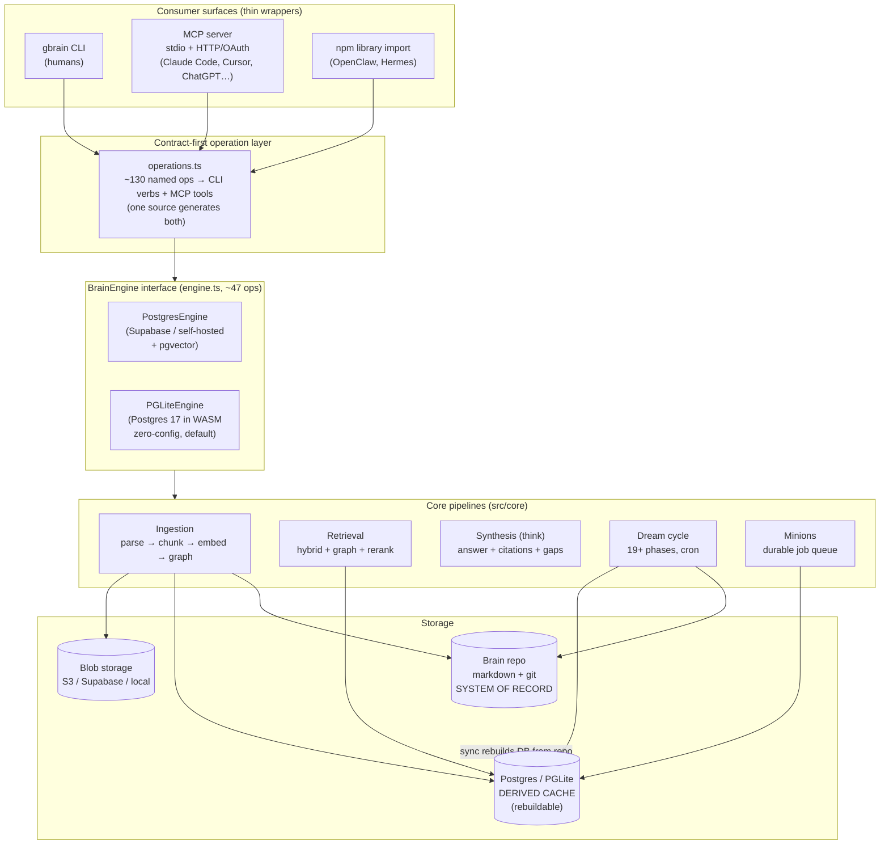
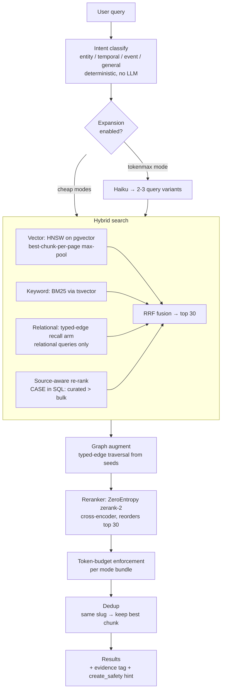
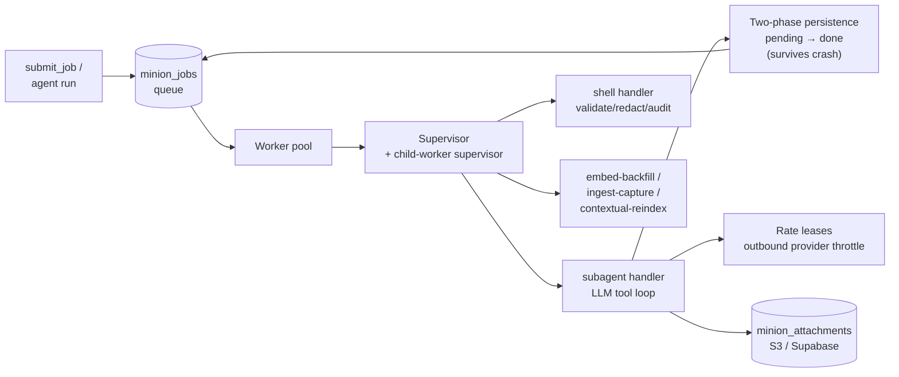
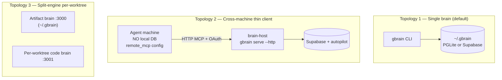

# GBrain — Architecture

> *Reverse-engineered from [`garrytan/gbrain`](https://github.com/garrytan/gbrain) (master, TypeScript/Bun, MIT).*
> "Search gives you raw pages. GBrain gives you the answer." GBrain is a Postgres-native **brain layer** for AI agents: it ingests markdown, builds a self-wiring knowledge graph, runs hybrid + graph retrieval, synthesizes cited answers with gap analysis, and runs a 24/7 "dream cycle" that enriches and consolidates memory autonomously.

---

## 1. What GBrain is

GBrain turns a folder of markdown files into a queryable **brain**. It sits between an AI agent and its knowledge, and does three things that a plain RAG box does not:

1. **Synthesis layer** — `gbrain think` doesn't return chunks, it returns a *cited answer* plus an honest "here's what the brain doesn't know yet" gap analysis.
2. **Self-wiring knowledge graph** — every page write extracts typed edges (`works_at`, `invested_in`, `attended`, …) with **zero LLM calls**, so relational queries ("who works at Acme?") resolve via graph traversal that vector search can't reach.
3. **Autonomous maintenance** — a cron-driven "dream cycle" dedupes people, fixes citations, finds contradictions, and consolidates facts into takes while you sleep.

The headline benchmark (BrainBench, 240-page corpus): **P@5 49.1 / R@5 97.9**, about **+31 P@5 points** over a graph-disabled hybrid baseline and over vector-only RAG.

---

## 2. The core loop

Everything in GBrain is organized around one loop that runs on every agent interaction, plus a background loop that runs on cron:

```
  signal   →   search   →   respond   →   write   →   auto-link   →   sync
 (every     (brain-first   (informed     (page +    (typed edges    (cron
  message)   retrieval)     by context)   timeline)  + backlinks)    keeps fresh)
```

- **Signal detector** runs on every inbound message — captures ideas, entity mentions, todos, names, links.
- **Brain-first lookup** happens before any external API call (cheapest, most personal source first).
- **Auto-link** fires on every page write — pure pattern matching on `[[wiki/people/bob]]`-style refs, no LLM. New entity → new page stub → graph grows.
- **Cron enrichment** (the dream cycle) runs the heavy, latent work overnight.

---

## 3. Layered architecture

GBrain is a **thin deterministic harness** (the engine + CLI: same input → same output) with **fat skills** (markdown recipes the agent reads) layered on top. The three consumer surfaces — CLI, MCP server, and library import — are all thin wrappers over a single `BrainEngine` contract.



### Contract-first generation (`src/core/operations.ts`)
A single declarative table of ~130 operations (`put_page`, `query`, `think`, `search`, `find_trajectory`, `whoknows`, `extract_facts`, `submit_job`, `schema_apply_mutations`, …) is the **one source** from which both the CLI verbs and the MCP tool definitions are generated (`src/mcp/tool-defs.ts` maps the same table into MCP tool schemas). Add an op once; it shows up in the CLI, over stdio MCP, and over HTTP MCP automatically. CLI-only commands (init, doctor, serve, migrations) bypass this layer.

### Two engines, one contract (`src/core/engine.ts`)
The `BrainEngine` interface defines ~47 operations. Two implementations satisfy it:

| Engine | Backing store | When |
|---|---|---|
| **PGLite** (default) | Postgres 17 compiled to WASM, single file, no server | Personal brains up to ~50K pages. `gbrain init --pglite` is ready in ~2 seconds, no Docker. Single-writer. |
| **Postgres** | Supabase or self-hosted Postgres + pgvector | Shared / large / multi-machine brains. Connection pooling, RLS, concurrent writers. |

Because both implement the same contract, the CLI, MCP server, and library never branch on engine — the engine factory (`engine-factory.ts`) picks one from config and everything above is engine-agnostic. (`docs/ENGINES.md` reserves SQLite as a future third engine.)

---

## 4. Data model & the "system of record" contract

**The git repo of markdown is the system of record. The database is a derived cache that is never backed up — it is rebuilt from the repo.**

```
gbrain rebuild --confirm-destructive   # wipe derived tables
gbrain sync && gbrain extract all       # regenerate everything from markdown
```

This is the single most important architectural invariant, enforced by a CI gate (`scripts/check-system-of-record.sh`) and an E2E round-trip test. Every table belongs to exactly one of three categories:

| Category | Examples | Rebuilt by |
|---|---|---|
| **FS-canonical** (markdown is truth) | `takes`, `facts`, `links`, `timeline_entries`, `tags` | A *reconciler* cycle phase that re-parses the markdown fence/frontmatter |
| **Derived-from-FS** (not user-authored) | `pages`, `content_chunks`, `page_versions` | The chunker + embedder on import |
| **DB-only by design** (runtime state) | `oauth_tokens`, `minion_jobs`, `mcp_request_log`, `dream_verdicts` | Not knowledge — re-enqueued or dropped on restart |

User knowledge lives in markdown in three structured forms that round-trip byte-identically:
- **Facts** — a `## Facts` table between `<!--- gbrain:facts:begin --> … :end -->` markers.
- **Takes** (hunches, bets, opinions) — a `## Takes` fence.
- **Timeline** — a `## Timeline` section after a `<!-- timeline -->` sentinel.
- **Links** — inline `[text](slug)` / `[[slug]]` in the body, plus frontmatter.

The **forget contract**: `gbrain forget` doesn't delete — it rewrites the fence row with strikethrough + `valid_until = today` + a `context:` reason, preserving the audit trail. The DB derivation (`expired_at = valid_until + now()`) reconstructs the forgotten state on every rebuild.

### The schema (≈45 tables, `src/schema.sql`)
Selected tables:

- `sources` — named content repos *inside* one brain (see §10).
- `pages` — one row per markdown file: `slug` (unique **per source**), `type`, `title`, `compiled_truth`, `timeline`, `frontmatter` (JSONB), `emotional_weight`.
- `content_chunks` — pgvector embeddings (1536-dim by default), HNSW index, cosine distance; `chunk_source` distinguishes compiled-truth vs timeline.
- `links` — typed graph edges (`knows`, `works_at`, `invested_in`, `founded`, `advises`, `attended`, `mentions`, …).
- `code_edges_symbol` / `code_edges_chunk` — code-graph edges for codebase brains.
- `timeline_entries`, `tags`, `page_versions`, `raw_data` (API sidecars), `files` (blob refs).
- `minion_jobs` / `minion_inbox` / `minion_attachments`, `subagent_messages` / `subagent_tool_executions` / `subagent_rate_leases` — the job queue (§9).
- `oauth_clients` / `oauth_tokens` / `oauth_codes` / `access_tokens`, `mcp_request_log` — the HTTP/OAuth surface.
- `calibration_profiles`, `take_proposals`, `take_grade_cache`, `dream_verdicts`, `eval_*` — the calibration/eval machinery.

Full-text search uses a **weighted tsvector** maintained by a trigger (so it can span `pages` + `timeline_entries`, which a generated column can't): title (A), compiled_truth (B), timeline (C).

---

## 5. Ingestion pipeline

```
INPUT (markdown files, git repo)
  ↓
FILE RESOLUTION        local → .redirect → .supabase → error
  ↓
MARKDOWN PARSER        gray-matter frontmatter + body
  → compiled_truth + timeline separation
  ↓
CONTENT HASH           SHA-256 idempotency — skip if unchanged
  ↓
CHUNKING (3 strategies, configurable)
  ├── Recursive   300-word chunks, 50-word overlap, 5-level delimiter hierarchy
  ├── Semantic    embed sentences → cosine similarity → Savitzky-Golay smoothing
  └── LLM-guided  Claude Haiku marks topic shifts in 128-word candidates
  ↓
EMBEDDING              batch 100, exponential backoff, non-fatal if it fails
  ↓
DB TRANSACTION         atomic: page + chunks + tags + version
  ↓
AUTO-LINK              extractEntityRefs → typed edges (zero LLM)
  ↓
SEARCH                 hybrid, available immediately
```

Key properties:
- **Idempotent** — `content_hash` short-circuits unchanged files, so a re-sync re-walks the git diff cheaply.
- **Auto-embed on import** — no separate embed step; `--no-embed` defers it, `embedded_at` enables `gbrain embed --stale` backfill later.
- **Crash-safe sync** — `gbrain sync --timeout` can exit `partial` with `last_commit` UNCHANGED so the next run resumes; `--max-age` self-heals wedged locks (uses `last_refreshed_at`, not `acquired_at`, so healthy long-runners are safe).
- **Privacy strip** — for untrusted readers (remote MCP / subagents) a 3-layer strip removes private fact/take fences before chunking, before `get_page` returns, and via git-tracking choice.

Ingestion sources are pluggable against a versioned `IngestionSource` contract (`gbrain/ingestion`) — skillpacks ship custom sources for Granola, Linear, voice, OCR, an inbox folder (`~/.gbrain/inbox/`), and a webhook `POST /ingest` endpoint.

---

## 6. Retrieval — the heart of the system

GBrain layers **four strategies** because each alone fails on real queries: vector drifts into thematic neighbors, keyword is brittle to phrasing, graph is blind to unlinked pages, and hybrid-without-graph can't answer "what is Y's relationship to X?".



**Reciprocal Rank Fusion (RRF)** merges vector and keyword rankings without globally weighting one over the other — each strategy votes (`score = Σ 1/(60 + rank)`).

**Named-thing retrieval** (4 layers added after a documented regression incident):
- *Per-page max-pool* — collapse chunk candidates to the best chunk per page (`DISTINCT ON (slug)`) before the user `LIMIT`, so a page surfaces on its strongest evidence.
- *Title-phrase boost* — a contiguous query token-run inside `page.title` gets a bounded multiplier.
- *Alias hop* — free-text `aliases:` frontmatter (e.g. "Hall of Light" → the Mingtang page) bridges true synonyms with zero surface overlap.
- *Evidence contract* — every result carries an `evidence` tag (`alias_hit | exact_title_match | high_vector_match | …`) and a `create_safety` hint (`exists | probable | unknown`) so an agent can decide "does this page already exist?" without guessing from a raw score.

**Reranker** — ZeroEntropy `zerank-2` cross-encoder reads query + each candidate jointly; on a 20-query benchmark it reshuffles **60% of top-1 results** after the hybrid+RRF+graph stack. +150ms p50, configurable, fully-local llama.cpp recipe available.

**Source-aware ranking** — a SQL CASE expression boosts curated dirs (`originals/`, `concepts/`, `writing/`) over bulk (`chat/`, `daily/`, `media/`); `archive/` is *demoted* (0.5×) not hidden; `test/`, `attachments/`, `.raw/` are hard-excluded.

**Three named modes** bundle the cost/quality knobs: `conservative`, `balanced` (default, reranker on, expansion off), `tokenmax` (expansion + rerank on). `gbrain search "<q>" --explain` shows per-stage score attribution.

### `search` vs `think`
- **`gbrain search`** → top retrieved pages by hybrid score. Fast, no LLM cost. Raw material to skim.
- **`gbrain think`** → runs the same retrieval, then composes a synthesized, **cited** answer *plus the gap analysis* — what's stale, what's uncited, what contradicts, what hole to fill. This is the "brain layer" differentiator.
- **`find_trajectory`** composes multiple angles in one shot ("how have metrics changed AND what's the team AND when did we last meet…").

---

## 7. The self-wiring knowledge graph

Every `put_page` runs `extractEntityRefs` over the markdown body and writes edges with **zero LLM tokens**:

- Standard links: `[Garry Tan](wiki/people/garry-tan)`
- Obsidian wikilinks: `[[wiki/people/garry-tan|Garry Tan]]` (optional global-basename resolution for cross-folder bare links)
- Typed-link blockquotes: `> **Convention:** see [path](path).`

Three regexes → a single free-text-safe `addLinksBatch` SQL call (`INSERT … SELECT FROM jsonb_to_recordset(...) JOIN pages ON CONFLICT DO NOTHING`). On a 17K-page brain a full graph extract finishes in seconds. Heuristic edge typing (`works_at`, `invested_in`, `founded`, `advises`, `attended`) is inferred from surrounding sentence context — also LLM-free. The graph is the **load-bearing wall**: it's where the +31 P@5 lift comes from, because the graph returns chunks that are *factually connected* rather than merely semantically close. Multi-hop traversal is exposed via `gbrain graph-query`.

---

## 8. The dream cycle (autonomous enrichment)

`src/core/cycle.ts` defines `runCycle` — an ordered pipeline of 19+ phases run on cron (the README cites 66 cron jobs in the author's production deployment). Phases run **filesystem-first, then index**, so the DB always picks up the fixed files:

```
Phase 1  lint --fix                  filesystem writes, no DB
Phase 2  backlinks --fix             filesystem writes, no DB
Phase 3  sync                        DB picks up phases 1+2
Phase 4  synthesize                  transcripts → pages
Phase 5  extract                     links/timeline from synced markdown
Phase 6  extract_facts               reconcile DB facts index from `## Facts` fence
Phase 7  extract_atoms               (pack-gated) atom extraction
Phase 8  resolve_symbol_edges        two-pass code-symbol resolution
Phase 9  patterns                    cross-session themes
Phase 10 synthesize_concepts         (pack-gated) concept synthesis
Phase 11 recompute_emotional_weight  salience scoring
Phase 12 consolidate                 cluster facts → synthesize one take per cluster (never deletes)
Phase 13 propose_takes               LLM proposes takes the brain hasn't captured
Phase 14 grade_takes                 grade accepted proposals
Phase 15 calibration_profile         voice-gated narrative (Hindsight calibration)
Phase 16 conversation_facts_backfill (opt-in)
Phase 17 enrich_thin                 develop thin stub pages
Phase 18 skillopt                    (opt-in) self-evolving skills
Phase 19 embed --stale               re-embed changed content
         orphans                     report-only
```

Design details:
- **Phase ordering is asserted in tests** (`report.phases.map(p => p.phase)).toEqual(ALL_PHASES)`) — ordering is load-bearing because later phases read state earlier ones mutate.
- **Phase-scope taxonomy** — each phase declares `source` / `global` / `mixed`; per-source autopilot cycles run only source-scoped phases, brain-wide phases (`embed`, `orphans`, `purge`) run once.
- **Locking** — only DB-write phases acquire the `gbrain_cycle_locks` lock; FS-only/read-only phases (lint, backlinks, orphans) skip it. The engine yields between phases (`yieldBetweenPhases`) to survive PgBouncer/Supavisor pooler blips, with self-retry + reconnect on bulk batch writes.
- **Budget caps** — per-phase LLM spend is metered (`budget-meter.ts`) so a runaway phase can't drain the API budget.

Brain consistency is wired in here too: `eval suspected-contradictions` samples retrieval pairs through a date pre-filter + query-conditioned LLM judge + persistent cache, surfacing conflicts between takes and facts.

---

## 9. Minions — the durable job queue

`src/core/minions/` is a **BullMQ-shaped, Postgres-native job queue** that replaces fire-and-forget `Promise`-based subagents with something crash-recoverable.



Capabilities:
- **Durable subagents** — LLM tool loops persisted via two-phase `pending → done`, so a crash mid-loop replays instead of losing work (`subagent_messages` / `subagent_tool_executions`).
- **Shell jobs with audit** — validate → redact → audit pipeline (`handlers/shell-*.ts`).
- **Child jobs with cascading timeouts**, **rate leases** (`subagent_rate_leases`) that throttle outbound providers, **backpressure / niceness / quiet-hours** controls, and **budget tracking** per job.
- **Attachments** via the pluggable storage backend (S3 / Supabase / local).

`gbrain agent run "…"` exposes the synthesis surface to a sub-agent through this queue — same answers, durable.

---

## 10. Two organizational axes: brains ⊥ sources

These are **orthogonal**. Misunderstanding them causes silent misrouting.

- A **brain** is a *database* (PGLite file, self-hosted Postgres, or Supabase). `--brain <id>` picks WHICH DB. Enumerated by your `host` brain + registered `mounts` (`~/.gbrain/mounts.json`).
- A **source** is a *named content repo inside one brain*. `--source <id>` picks WHICH REPO. Every `pages` row carries `source_id`; slugs are unique **per source** (so `topics/ai` can exist under both `wiki` and `gstack`).

```
WHICH BRAIN (DB)?                     WHICH SOURCE (repo in DB)?
 1. --brain <id>                       1. --source <id>
 2. GBRAIN_BRAIN_ID env                2. GBRAIN_SOURCE env
 3. .gbrain-mount dotfile              3. .gbrain-source dotfile
 4. longest-prefix mount-path match    4. longest-prefix source-path match
 5. (reserved)                         5. sources.default config
 6. fallback: 'host'                   6. fallback: 'default'
```

**Rule of thumb:** if the *data owner* changes → brain boundary. If the owner stays but the topic/repo changes → source boundary. Cross-brain federation is the *agent's* job, not the DB's — the agent sees `gbrain mounts list`, decides when to fan out, and synthesizes, citing `brain:source:slug`. This keeps access control clean and debugging sane (cross-brain queries are intentionally non-deterministic).

---

## 11. Deployment topologies



1. **Single brain** (default) — one local DB, `gbrain serve` exposes it to one agent over MCP.
2. **Cross-machine thin client** — agent runs on machine A with *no local engine*; all queries/embeds/indexing happen on remote `brain-host` over HTTP MCP + OAuth. The thin client's config carries `remote_mcp` instead of a DB connection, and a dispatch guard *refuses* every DB-bound command (`sync`, `embed`, `extract`, `migrate`, `serve`) with an error pointing at the host.
3. **Split-engine** — separate artifact brain + per-worktree code brains on different ports, for Conductor-style parallel worktrees that shouldn't share a code index.

All three compose on one machine because every shape resolves to "which `~/.gbrain/config.json` is active?", controlled by `GBRAIN_HOME`.

---

## 12. Surfaces & distribution

```
+-----------------+   +-----------------+   +-----------------+
|  npm library    |   | compiled binary |   |   MCP server    |
|  bun add gbrain |   |   gbrain CLI    |   | gbrain serve    |
|  WHO: OpenClaw, |   |   WHO: humans   |   | WHO: Claude Code,|
|  Hermes         |   |                 |   | Cursor, ChatGPT |
+--------+--------+   +--------+--------+   +--------+--------+
         |                     |                     |
         +----------+----------+----------+----------+
                    v                     v
              operations.ts  →  BrainEngine (PGLite | Postgres)
```

**MCP** is the primary agent surface (30+ tools):
- **stdio** (`gbrain serve`) — local subprocess for Claude Code, Cursor, Windsurf. No per-token auth (local pipe); defaults `remote=true` and a `['world']` takes allow-list so private hunches aren't exposed. Injects `_meta.brain_hot_memory` alongside every tool response.
- **HTTP** (`gbrain serve --http`) — required for Claude Desktop/Cowork, Perplexity, ChatGPT. Ships **OAuth 2.1 + PKCE**, DCR-style client registration, scope-gated access (`read` / `write` / `admin`), rate limiting, and an admin dashboard at `/admin` (a Vite/React SPA in `admin/`). Both transports share `src/mcp/dispatch.ts` for parity.

`gbrain connect https://host/mcp --token … --install` wires a remote brain into a coding agent and smoke-tests the token before handoff.

---

## 13. Schema packs — the brain's shape is configurable

GBrain has **no fixed page taxonomy**. A *schema pack* declares what page types exist, what they link to, and what facts get extracted. The default is `gbrain-base-v2` (15-type DRY/MECE taxonomy: `person`, `company`, `media`, `deal`, `email`, `project`, `note` catch-all, …). You can `gbrain schema detect` (cluster your filesystem), `suggest` (LLM refine), `review-candidates --apply` (human gate), or author your own.

The active pack threads through **every read+write path**: `parseMarkdown` infers page type from the pack's path prefixes; `whoknows` scopes expert routing to types declared `expert_routing: true`; `extract_facts` runs only on `extractable: true` types; and the search cache folds the pack name+version into its key so cross-pack contamination is structurally impossible. Packs declare `migration_from:` so existing brains can opt into a successor. Resolution is a seven-tier chain (per-call flag → env → per-source DB key → brain-wide DB key → `gbrain.yml` → `~/.gbrain/config.json` → default). Agents can evolve the schema via 14 `gbrain schema` verbs + a batched `schema_apply_mutations` MCP op (admin scope), with atomic file locks, an audit log, and chunked 1000-row backfills that never wedge concurrent writers.

---

## 14. Security model

- **Postgres RLS** on the schema; HTTP MCP gated by **OAuth 2.1 (+ PKCE for ChatGPT)** with `read`/`write`/`admin` scopes, DCR-style registration, and rate limiting.
- **Per-person brain slices** — each login sees only its allowed slice (search, list, lookup, multi-source reads); the README claims zero leaks across fuzz-testing every read path — the "company brain" use case.
- **3-layer privacy strip** for untrusted readers (chunker strips private fences pre-embedding; `get_page` strips on `ctx.remote`; git-tracking is the user's choice; `db_only` paths in `gbrain.yml` stay on disk, never in git).
- **SSRF validation** (`ssrf-validate.ts`, `url-safety.ts`), secret redaction in shell-job audit and source-config, a `destructive-guard`, and ReDoS protection (`gbrain schema lint` warns on nested-quantifier regexes; runtime caps inference-regex input length).
- Threat model in `SECURITY.md`.

---

## 15. Repo map

| Path | What lives there |
|---|---|
| `src/core/engine.ts`, `postgres-engine.ts`, `pglite-engine.ts` | The `BrainEngine` contract + two implementations |
| `src/core/operations.ts` | The ~130-op contract that generates CLI verbs + MCP tools |
| `src/cli.ts`, `src/commands/` (~143 files) | CLI dispatch + per-command handlers |
| `src/mcp/` | MCP server: `server.ts` (stdio), `http-transport.ts`, `dispatch.ts`, `tool-defs.ts`, `rate-limit.ts` |
| `src/core/cycle.ts`, `src/core/cycle/` | The dream cycle + phase implementations |
| `src/core/minions/` (~47 files) | The durable job queue |
| `src/core/search/` | hybrid, dedup, RRF, intent, expansion, SQL ranking |
| `src/core/chunkers/` | recursive / semantic / LLM-guided chunking |
| `src/core/schema-pack/` | schema-pack engine |
| `src/core/skillpack/`, `src/core/skillopt/` | skill packaging + self-optimizing skills |
| `src/core/facts/`, `takes-*`, `calibration/` | FS-canonical knowledge + Hindsight calibration |
| `src/schema.sql` | full DDL (~45 tables, RLS, tsvector trigger, HNSW) |
| `admin/` | React/Vite operator dashboard served at `/admin` |
| `skills/` (~128 files), `recipes/` (~67) | fat markdown skills + integration recipes |
| `docs/architecture/` | topologies, retrieval theory, system-of-record, thin-client |
| `evals/`, `test/` (~1300 files) | eval framework + the test suite that pins invariants |

---

## 16. Why it works — the design thesis

1. **Markdown is truth, DB is cache.** Disaster recovery, multi-machine sync, and cross-agent collaboration all reduce to "git + rebuild." Nothing irreplaceable lives only in Postgres.
2. **The graph is the moat.** Zero-LLM auto-linking on every write keeps a factual graph fresh; that graph is what lifts retrieval +31 P@5 over vector-only RAG.
3. **Synthesis + gap analysis, not chunks.** `think` returns an answer *and tells you what the brain doesn't know* — the difference between a search engine and a brain.
4. **Thin deterministic harness, fat markdown skills.** The engine is reproducible; intelligence lives in agent-readable skills and recipes that anyone can fork.
5. **One contract, many surfaces.** Two interchangeable engines and one operation table mean CLI, MCP (stdio + HTTP), and library import all stay in lockstep for free.
6. **It maintains itself.** The dream cycle is the part that keeps a 100K-page brain sharp without a human in the loop.

---

*This document was reconstructed by reading the repository's own README, `DESIGN.md`, `docs/architecture/*` (topologies, retrieval, system-of-record, brains-and-sources, infra-layer, thin-client), `docs/GBRAIN_V0.md`, and the source structure of `src/core/{engine,cycle,operations,minions,search}`, `src/cli.ts`, `src/mcp/`, and `src/schema.sql`. Version-specific numbers (benchmark scores, table counts, phase lists) reflect the state of `master` as of mid-2026 and the project's own published figures.*
